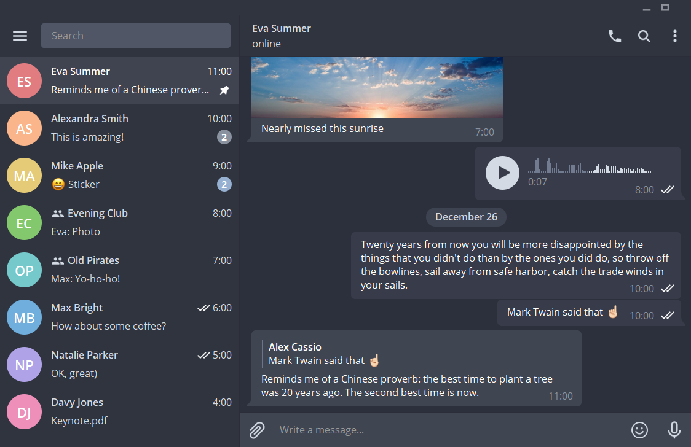
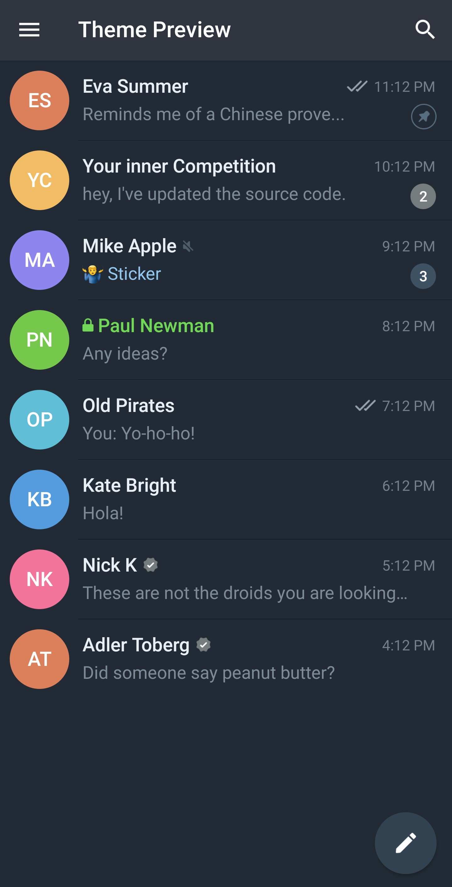
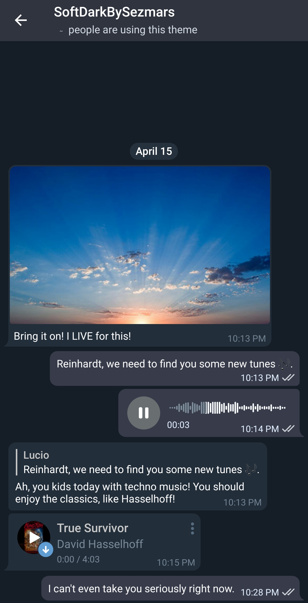

# Soft Dark Theme for Telegram Desktop, Android

This repo contais some Soft Dark themes for Telegram Desktop, Android.  

Choose platform below or scroll down to installation instructions and screenshots.  

Read about desktop dheme |  Read about android theme
:-------------------------:|:-------------------------:
[Telegram Desktop](#tdesktop)  |  [Android](#android)

# TDesktop

Installation:  
• Open [Releases](https://github.com/sezmars/telegram-soft-dark-theme/releases) section and find the most recent release tagged **[TDesktop]**.  
• Download file with `tdesktop-theme` extension and send it to yourself in Telegram.  
• Click on uploaded file and press "Apply Theme".

Here's for example how Soft Dark for TDesktop looks like:

# Android

**Installation**:  
• Open [Releases](https://github.com/sezmars/telegram-soft-dark-theme/releases) section and find the most recent release tagged **[TAndroid]**.  
• Download file with `attheme` extension and send it to yourself in Telegram.  
• Click on uploaded file and press "Apply Theme".

Here's for example how Soft Dark for TAndroid looks like:

Theme for Android Preview  |  Theme for Android Chat
:-------------------------:|:-------------------------:
  |  

### How to modify & install theme for Telegram

There's an [official guide](https://telegram.org/blog/android-themes) how to make themes
